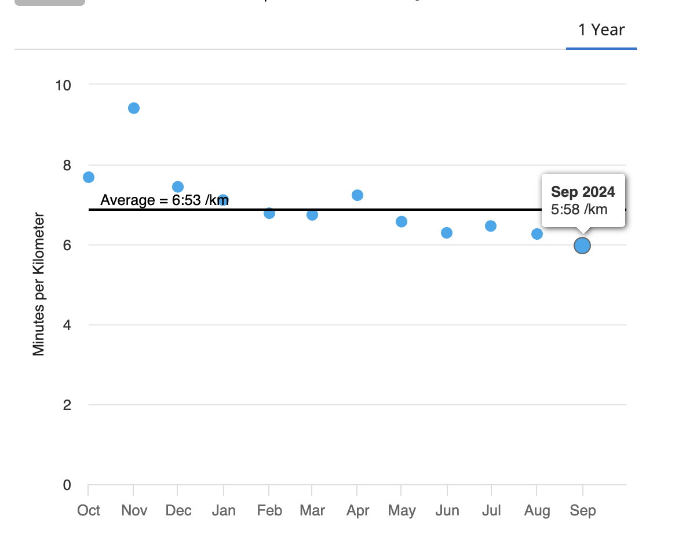

## The beginnings 

I started running around when we (my wife and I) moved to San Francisco in 2014. We used to live next to the Presidio Park in the Marina, and I would go downhill towards the Palace of Fine Arts and then jog in Crissy Fields and get to the Golden Gate Bridge. Most of the time, fighting against the breeze in both directions. I never understood that, but it always felt like the wind was in front of me. 

At the time, I didn't have any kind of schedule. I would just run when it felt right. I was probably moving very slowly and wouldn't care about my pace or anything. I would listen to podcasts while running and also music, but mostly podcasts. I have a Spotify [playlist](https://open.spotify.com/playlist/3512C2sHz6AcgM6QS0mX5v?si=2217322907d14c78) that I've been maintaining for 15 years now, and I would listen to music from that list. But that's a story for another time. 

I did a few races and, at some point, ran the San Francisco Half Marathon. Without proper training, it was brutal, but I did it and felt good. 

## Becoming a runner

That went on for about six years. I ran here and there, but I would never consider myself a runner at the time. Then, the pandemic happened, and I started running daily. It became a meditation. We spent some months in Miami, and through those painful times, some of my best memories are of running next to Hollywood Beach. Maybe it kept me sane. But I don't know—that could be counterfactual.

Since then, I have run almost daily. There were many weeks when I would run seven days per week, especially after a night out. There is nothing like shaking out a hungover with a good run. Running in cities I visited while traveling became one of my favorite activities during vacation. 

Somewhere in 2021, after doing these for many years, it became apparent in my brain that I really like to run and that it is fair to say I'm a runner. 

## Then New York Happened

We moved to New York City in 2022. What do you want to do when you move to NYC? Run the Marathon, of course. The idea grew in my head throughout that year, and by the summer, I was pretty sure I wanted to do it. 

For people who live in New York, there is this thing called 9+1, where you can participate in 9 races and 1 volunteering event and "qualify" for the Marathon. 

So now I have a goal: in 2023, I do 9+1, and then the Marathon in 2024. But no plan. The first realization was that my usual pace in all these years was really slow for a marathon. It was going to take me 6 hours to finish. I started to work on improving my pace. And like any stellar rookie, I got injured. So, most of 2023 was just doing the minimum to participate in easy races and recovering from a very annoying (mild) injury in my hamstrings. 

But I did it! I finished the races and the volunteering event (where my phone got stolen, and I volunteered under the rain on a humid spring morning for the Brookling half). However, it was done! 2024 years _could_ be the year to run the Marathon.

## The training

For most of the year, I've been slowly ramping up. I've focused on strength training with tons of mobility exercises. For the first time, I started liking going to the gym. But that's another story for another time. 

Also, my running has structure for the first time in many years, and I've been slowly building the volume in preparation for the Marathon. 

The average week was looking something like this for the cardio/running:
Monday: Easy run 6:30 minutes per KM / 40 minutes.
Tuesday: Some track work (e.g., 20*200 meters 4:30 min /km)
Wednesday:  VO2 Max workout (e.g., Norwegian 4x4 )
Thursday:  Easy run 6:30 minutes per KM / 40-50 minutes.
Friday: Tempo / Threshold work.
Saturday: Long Run 10km  / 15km push pace for me.

That was the schedule for most of the year, and with consistent training, my pace kept getting better. Here is a picture of the evolution:

Today, we are 7 weeks and 4 days before the Marathon. The training now looks quite different, and the most important part is no longer the pace for me. I'm focused on building the volume. Running more than 21 Km, it was mostly uncharted territory. Last weekend, I ran 27km for the first time. But as the volume increases, my body kind of resents it. But then it gets used to... Or at least that has been what I've seen so far. But if I run 27 Km, I can't run 6 times per week right now. I'm trying to be mindful and tune the volume to push the limits while not getting injured. 

If everything goes well, my long runs will reach 35 km in the next four weeks. After that, as they say, the other 7 km in the Marathon will happen, one way or another. 

I will document some of the learnings in these next 4 weeks. 

## Why to run? 

This has been a lengthy post about this journey. There isn't any justification for the reasoning. Is it required to have some sort of closure? If I have anything to add, the main reason is that I found it fun. I would lie if I said there is some profound experience in this activity every time I go out... however... sometimes... in some runs... You go through everything. There is joy, there is pain, there is suffering, there is boredom... All packed in the span of a few hours. Those runs are not just a _run_. They are a window into living multiple lives. 
