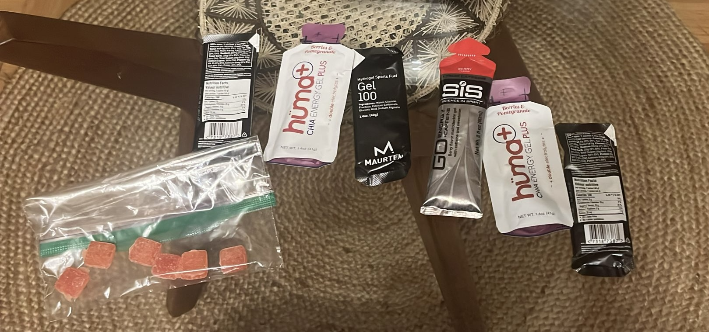

I've been trying to figure out how to fuel during long runs. I have learned that it matters when you start running for more than 1 / 1.5 hours. 

Here's a summary of my protocol and what I'm currently tweaking. I'll also share some thoughts on what to be careful of during long runs. 

## What to be careful?
- I'm stating the obvious, but hydration is so so important. It is something that is initially overlooked. I did not care too much about drinking enough water during my long runs, which had a considerable impact. I used to think that I could drink enough water before running and stop a few times during my long run, and that should be enough. That is not enough. Drink enough water.
- I eat enough carbohydrates before the long run. Ideally, the day before, I do some sort of carb loading throughout the day. 

##  Current Protocol

### Week Before

I'm running the long run on Saturdays. Right now, they are around 17 miles (27km). In the next 4 weeks, I should get up to 35km. I'm also reasonably active during the week:
2 - 3 times of strength training. 
1-2 easy runs during the weeks.
1 speed day. 

So, my regular schedule is:
- Sometimes, I run on Monday / Thursday (based on how recovered I am, I migth skip these days to get more rest before and after the long run). 
- Running / strength routines Tuesday / Wednesday. 
- Friday / Sunday are always off right now.  

With that amount of exercise, I'm doing the following:

- 150 grams of protein per day.
- 150-200 grams of carbs per day when I run. 
- I eat around 300 grams of carbs on Fridays in preparation for the long run. This is working quite nicely, and I feel a big difference on Saturdays when I'm properly prepping on Fridays. What are 300 grams of carbs? Something like:
  - 2 slices of bread (40g -50g), peanut butter (10g), jam (20g). 
  - Big bowl of rice with chicken (100g).
  - Mush overnight oats as a snack (30g - 35g).
  - Big pasta bowl with bolognese or tomato sauce (100g).

I briefly touch on it, but the critical piece I've been paying attention to is my recovery. I care equally about my subjective feelings (how tired I feel or if I'm too sore) and the more objective feedback my [Whoop](https://whoop.com) gives me. I used this signal to decide if I exercise on Monday / Thursday right now. Ultimately, good sleep and recovery are probably more important than nutrition.  

### Day of the long run (before running).
I take a double espresso shot as soon as I wake up. Sometimes, I forget about this, and I struggle after the first hour. 
The bread with jelly and peanut butter. Sometimes, as a banana as well. 
Good warm-up stretching, focusing on the hips and hamstrings and warming up the quads. 
Some electrolytes (liquid IV or something like that)

### Day of the long run (while running).

This is the area where I'm learning the most right now. This is what I'm doing at the moment:
Water: I take small sips every time I can. If I'm in a race with infrastructure, I stop at every station. Someone once told me that the water you drink in the first mile is the water you will need in mile 10. Never wait until you are thirsty. 

**Fuel**: I listened to this [episode](https://open.spotify.com/episode/5PUWnbrNKJFshAOay5uTzW?si=20df1d8456d3475e) with Luc van Loon in Peter Attia's podcast. He mentioned that you should get around 60-70 grams of carbs per hour during endurance events. Of course, this depends on your weight, how fast you are running, and god knows what other variables. However, it still seemed like a good heuristic. I've been doing the following, and it has been working:
  - First gel at minute 40. 
  - Then, another gel every 25 to 30 minutes. I have tried every 20 minutes (which seemed like too much for me, with no benefits, and I actually felt kind of sick after it) and every 40-45 minutes (this was actually too slow, and I was feeling already tired by the time I took the gel, which was not ideal).  
  - Most gels contain around 20 grams of carbs, so I'm eating between 50g and 60g per hour, which seems to be the sweet spot for me. 
  - Around 1 hour and 30 minutes, I include a gel with caffeine. This gives me a boost for the last leg of the run. Probably going to take 2 of those during the marathon. 

**Electrolytes**:  I'm tweaking this part right now. Some gummies and fuel gels from Huma also provide electrolytes. I have around 300mg of electrolytes per hour (which might be too little). 

Last but not least, below is a picture with all this setup before going for the run:

