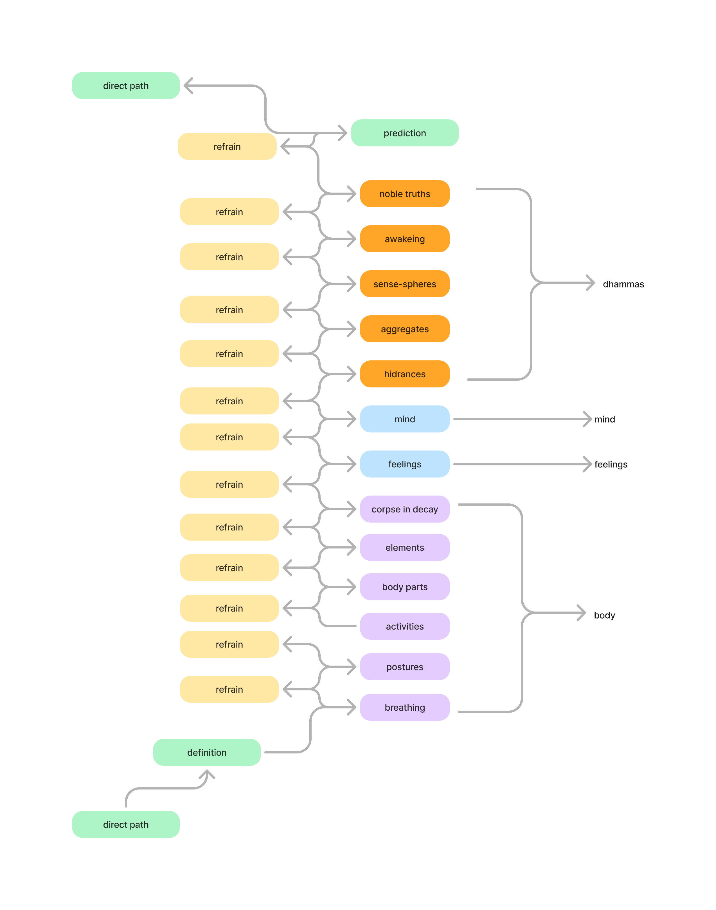

I've been exploring buddhism and mindfulness over the last 5 years. This has been mostly through a really good audio series in Sam Harris's [Waking Up](https://wakingup.com/). It is a set of [teachings](https://dynamic.wakingup.com/pack/P3A339) by Joseph Goldstein. 

In those teachings, Joseph Goldstein has references to a book by Bhikkhu Analayo that provides a translation and a commentary to the Satipatthana Sutta.  For context, the Satipatthana Sutta is one of the core teachings of Buddhism. It is a text that describes the Four Foundations of Mindfulness. 

I had read these four foundations before, however appreciated the structure and how approachable this books makes it. Below a visual representation (from the book) about the structure of these teachings:

The refrain is repeated 13 times. It goes something like this:

*In this way, in regard to the body (feelings, mind, dhammas) one abides contemplating the body (feelings, mind, dhammas) internally, or one abides contemplating externally, or one abides contemplating both internally and externally.*

*One abides contemplating the nature of arising in the body (feelings, mind, dhammas)…. The nature of passing away in….or the nature of both arising and passing away in.*

*Mindfulness that ‘there is a body’ (feelings, mind, dhammas) is established in one to the extent necessary for bare knowledge and continuous mindfulness.*

*And one abides independent, not clinging to anything in the world…*

## Notes

I don't have much to add right now. I'm still reflecting on this. I liked this visual representation of the teachings and left here for future reference.

